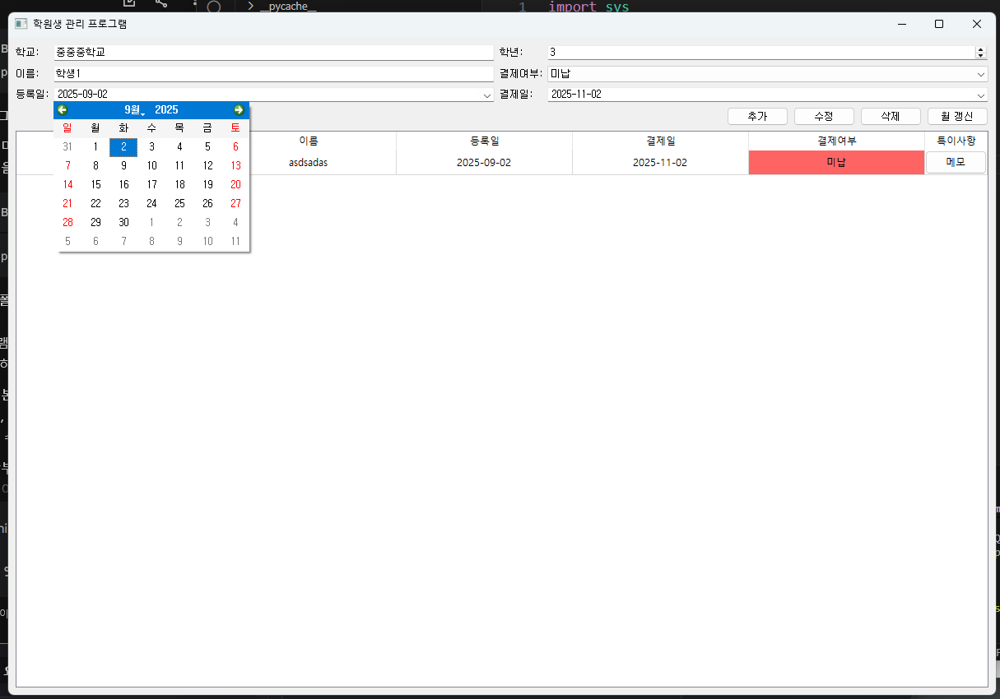
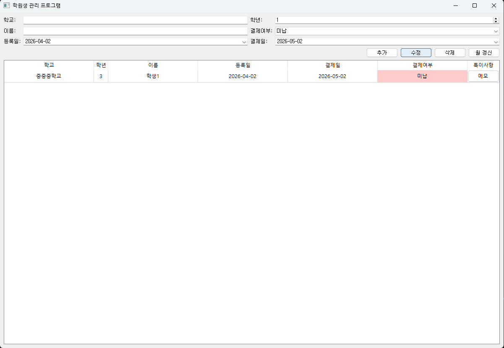
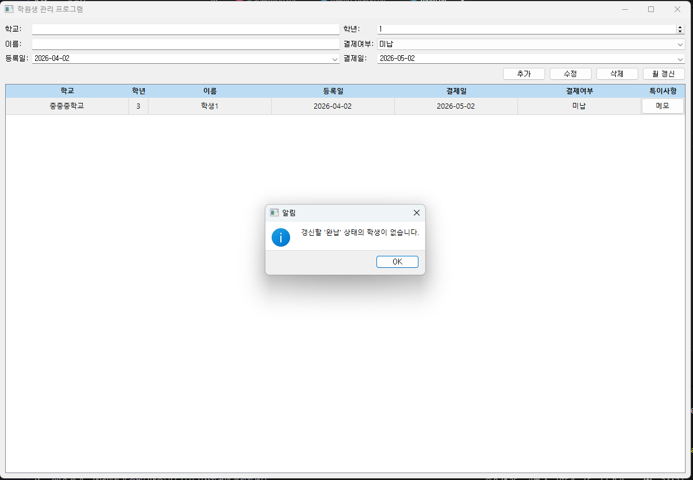
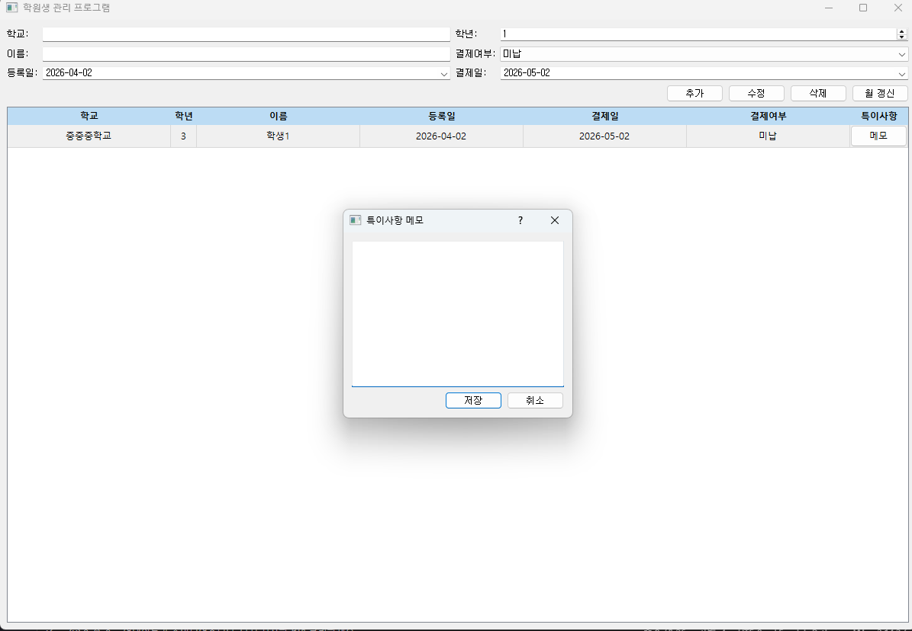

# 학원 수강료 관리 프로그램 (Tuition Management System)

PyQt5와 MySQL을 연동하여 제작한 학원 수강생 관리 및 수강료 납부 기한 관리 프로그램입니다.  
어머니께서 학원을 운영하시는데, 학원생들마다 수업료 납부 일이 다 다르기 때문에 계산하기 힘들다고 하셔서 학원 운영 업무 효율을 위해 개발하였습니다.  

## 🛠 기술 스택
- **Language**: Python 3.9
- **UI Framework**: PyQt5
- **Database**: MySQL

## ✨ 주요 기능
- **수강생 명단 관리**: 수강생 정보(학교, 학년, 이름 등) 추가, 수정, 삭제 및 전체 목록 출력
- **납부 날짜 자동 계산**: 등록일(`date`)을 기준으로 1개월 뒤의 납부 예정일(`d_date`)을 자동 계산
- **납부 상태 시각화**: 
  - **납부 확인**: 별도 표시를 통해 관리
  - **미납 상태**: 납부가 확인되지 않은 경우 명단에 **빨간색(Red)**으로 표시하여 직관적인 확인 가능

## 📸 화면 및 상세 기능

### 1. 메인 화면 및 자동 날짜 계산

- 학원생의 기본 정보(학교, 학년, 이름)와 등록일을 입력하면, **한 달 뒤의 결제일이 자동으로 계산**되어 표기됩니다.

### 2. 날짜 선택 및 미완납 상태 변경


- 직관적인 캘린더 팝업을 통해 날짜를 쉽게 선택할 수 있습니다.
- 콤보박스를 통해 **'미납' / '완납' 상태를 즉각적으로 변경**할 수 있으며, 미납 상태일 경우 테이블에 붉은색으로 강조되어 한눈에 파악이 가능합니다.

### 3. 정보 수정

- 등록된 학원생의 정보를 쉽게 수정할 수 있습니다.

### 4. 월 갱신 (일괄 재청구 시스템)

- 수업료를 모두 낸 **'완납' 상태의 학생들을 대상으로 '월 갱신' 버튼**을 누르면, 다음 달 청구를 위해 일괄적으로 상태를 '미납'으로 변경하고 결제일을 한 달 뒤로 미룹니다. 매달 수동으로 초기화할 필요가 없습니다.

### 5. 특이사항 메모

- 학원생별로 참고해야 할 특이사항을 기록할 수 있는 부가적인 메모 팝업 기능을 제공합니다.

## 🗄 데이터베이스 구조 (Table Schema)
| 컬럼명 | 타입 | 설명 |
| :--- | :--- | :--- |
| **id** | INT (PK, AI) | 고유 식별 번호 (Key) |
| **school** | VARCHAR | 학교 |
| **grade** | VARCHAR | 학년 |
| **name** | VARCHAR | 이름 |
| **date** | DATE | 등록 날짜 |
| **d_date** | DATE | 한 달 뒤 납부 예정일 |
| **commit** | VARCHAR | 납부 확인 여부 (미납/완납) |
| **etc** | TEXT | 특이사항 메모 |

## 🚀 설치 및 실행 방법

1. **필수 라이브러리 설치**
   ```bash
   pip install PyQt5 pymysql python-dateutil
   ```
2. **데이터베이스 세팅**
  ```bash
  mySQL 환경에 academydb를 생성, students 테이브 추가(academydb.sql)
  ```
3. **프로그램 실행**
  ```bash
  python main.py
  ```
